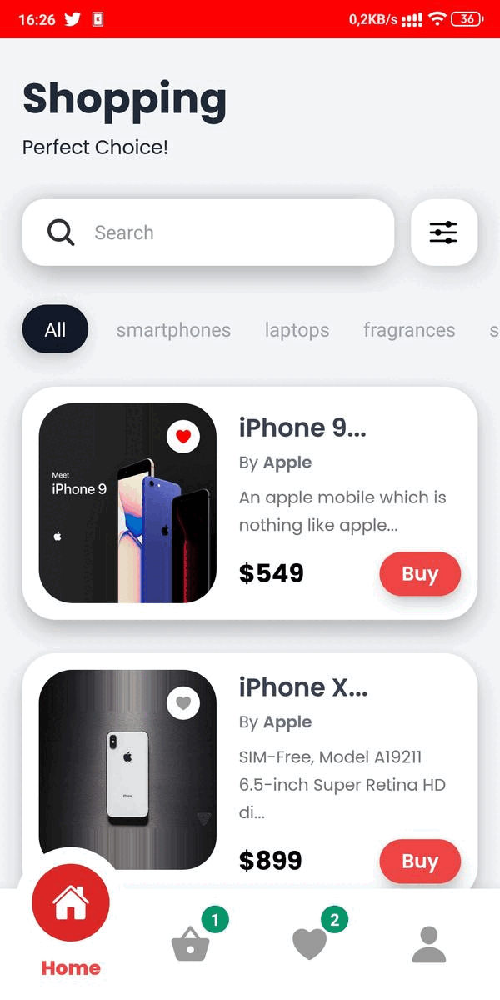

# React Native Shopping App
A shopping app built in React Native with Redux, fetching DummyJSON API, React Navigation and TailwindCSS.

## Built with;

- [DummyJSON](https://dummyjson.com/)

- [React Native](https://reactnative.dev/)
- [React](https://tr.reactjs.org/)
- [React Hooks](https://reactjs.org/docs/hooks-intro.html)
- [Redux](https://redux.js.org/)
- [React Navigation](https://reactnavigation.org/)
- [Tailwind React Native Classnames](https://www.npmjs.com/package/tailwind-react-native-classnames)
- [React Navigation - Bottom Tabs](https://reactnavigation.org/)
- [React Native Async Storage](https://github.com/react-native-async-storage/async-storage)
- [React Native Swipe Gestures](https://www.npmjs.com/package/react-native-swipe-gestures)
- [React Native Swipeable](https://docs.swmansion.com/react-native-gesture-handler/docs/troubleshooting)

## Contributing;

- If you have problems please leave an issue from [here](https://github.com/eeguney/my-portfolio-site/issues)
- Consider forking the project and submitting new pull requests. I am much likely control [my github account](https://github.com/eeguney/)

# How to build/run the projects

## General requirements before running any specific project

- `npm install` to install all the dependencies, React and React Native among others.

### With some versions of npm (>=v3.3.10 <=v3.6.0)

Some builds from npm included bugs while `npm install`. So if you are using a npm version within the range form 3.3.10 to 3.6.0 included, you must run `npm install` twice. Those versions including npm v3.3.12 are the ones bundled by default with node from version v5.1.0 to v5.5.0.

- `npm install npm`
- `npm install npm` run it twice, because of the packages won't be installed after the first run [#10985](https://github.com/npm/npm/issues/10985)

## The Mobile Apps (iOS & Android)

### Requirements for React Native

#### iOS

- OS X
- Xcode 6.3 or higher is recommended (Xcode only runs on Mac).
- Homebrew is the recommended way to install node, watchman, and flow.
- `brew install node`
- `brew install watchman`. We recommend installing watchman, otherwise you might hit a node file watching bug.
- `brew install flow`. If you want to use flow.

#### Android

- Follow the official documentation guide here: http://facebook.github.io/react-native/docs/getting-started.html#android-setup (includes experimental Windows & Linux support)

### Running the Mobile Apps

#### iOS

- Open iosApp.xcodeproj and hit run in Xcode.
- Hit cmd+R in your iOS simulator to reload the app and see your change!

#### Android

- Open an emulator. (Genymotion or run `android avd`)
- Run the `react-native run-android` in the root of this project.
- If trying to run on a device, read the following guide: http://facebook.github.io/react-native/docs/running-on-device-android.html#content

Congratulations! You've just successfully run the project as an iOS or Android App.

# Licence
  
MIT License

Copyright (c) 2022 Emre Güney

Permission is hereby granted, free of charge, to any person obtaining a copy
of this software and associated documentation files (the "Software"), to deal
in the Software without restriction, including without limitation the rights
to use, copy, modify, merge, publish, distribute, sublicense, and/or sell
copies of the Software, and to permit persons to whom the Software is
furnished to do so, subject to the following conditions:

The above copyright notice and this permission notice shall be included in all
copies or substantial portions of the Software.

THE SOFTWARE IS PROVIDED "AS IS", WITHOUT WARRANTY OF ANY KIND, EXPRESS OR
IMPLIED, INCLUDING BUT NOT LIMITED TO THE WARRANTIES OF MERCHANTABILITY,
FITNESS FOR A PARTICULAR PURPOSE AND NONINFRINGEMENT. IN NO EVENT SHALL THE
AUTHORS OR COPYRIGHT HOLDERS BE LIABLE FOR ANY CLAIM, DAMAGES OR OTHER
LIABILITY, WHETHER IN AN ACTION OF CONTRACT, TORT OR OTHERWISE, ARISING FROM,
OUT OF OR IN CONNECTION WITH THE SOFTWARE OR THE USE OR OTHER DEALINGS IN THE
SOFTWARE.

